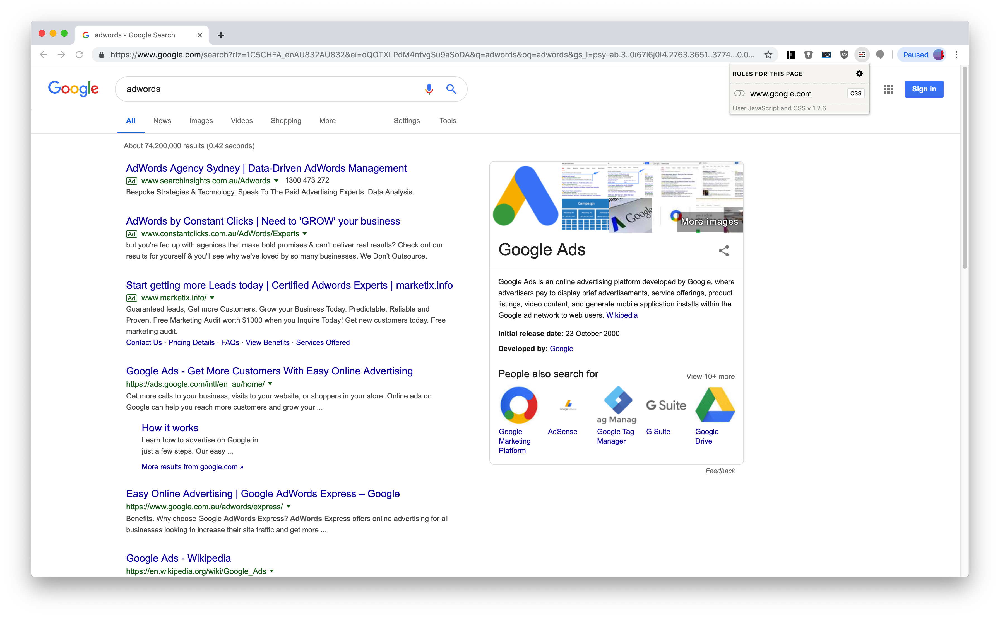
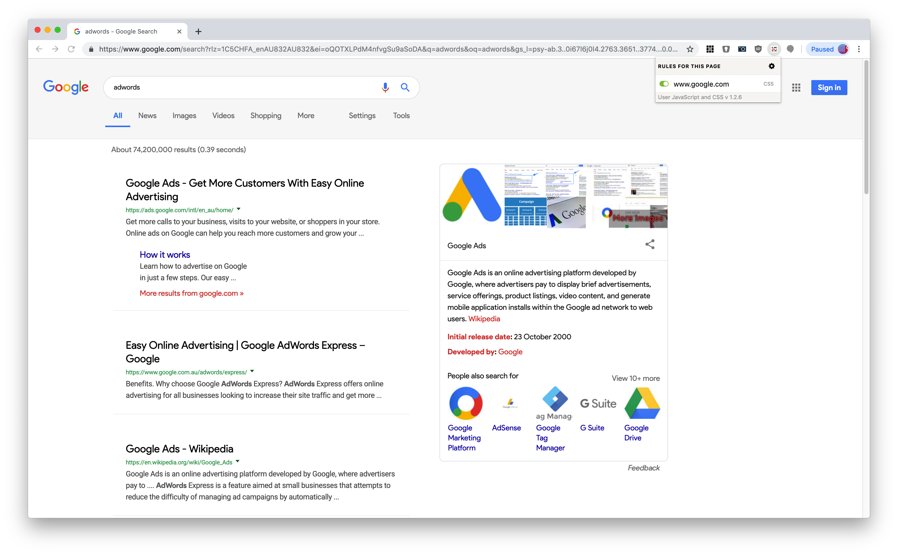

# CleanSearch-CSS
Display a clean google search results page (no ads at the top) with material looking UI.

## Install Instructions
* install one of these extensions for your browser <a href="https://chrome.google.com/webstore/detail/tampermonkey/dhdgffkkebhmkfjojejmpbldmpobfkfo">Tampermonkey</a> / <a href="https://chrome.google.com/webstore/detail/violentmonkey/jinjaccalgkegednnccohejagnlnfdag">Violentmonkey</a> / <a href="https://addons.mozilla.org/en-US/firefox/addon/greasemonkey/">Greasemonkey</a>
* install the <a href="https://openuserjs.org/scripts/MilionMax/Google_Clean_Search">GoogleCleanSearch</a> script

** NOTE: if you're installing on Opera browser make sure to enable (Allow access to search page results) in "Manage Extension Settings"

## Alternative
* Step 1 - install chrome extension : 
https://chrome.google.com/webstore/detail/user-javascript-and-css/nbhcbdghjpllgmfilhnhkllmkecfmpld 
* Step 2 - open a new tab 
* Step 3 - click on the user CSS / Javascript icon from the chrome toolbar 
* Step 4 - click on the settings wheel for rules 
* Step 5 - click + Add new site button 
* Step 6 - replace *.example.com with www.google.com 
* Step 7 - copy and paste the CSS in <a href="https://github.com/maximilianotaverna/clean-search-CSS/blob/master/googlesearch_rule.css">googlesearch_rule.css</a> into the CSS pane & save
* Step 8 - perform a google search in a new tab  

# Note
'Product Sans' is under the google product sans license. Hence, it is not Open Source, and is strictly not for any use other than in the google logo. This is strictly not for commercial use. However, there are other free typefaces included in the script that can be un-commented for use. 

